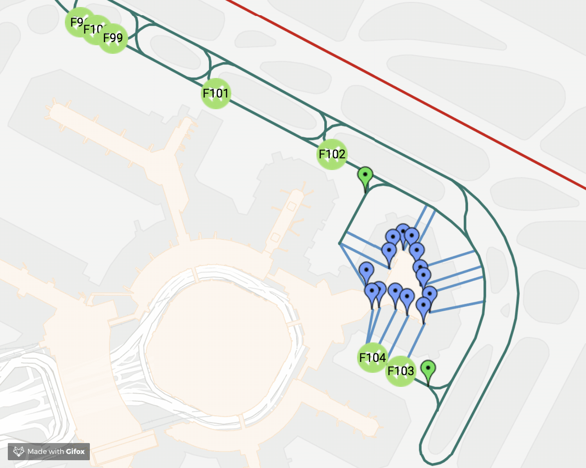

# ASSET2 - Airport Surface Simulator and Evaluation Tool 2

[](https://travis-ci.org/heronyang/airport-simulation)



## About

ASSET2 is a generic airport simulation tool for research purpose. It is designed to support multiple airports, to test and to evaulate customized schedulers.

> This tool is built for Carnegie Mellon University MSIT Practicum Project and Master Independent Study sponsored by the NASA Ames Research Center.

Please check out following materials for more information.

- [Video](https://www.youtube.com/watch?v=zpHWQc2RBQ0)
- [Slides](doc/practicum/report/slides.pdf)
- [One Pager](doc/practicum/report/one-pager.pdf), [Paper report](doc/practicum/report/report.pdf)

## Prepare airport data

Place airport related data under `data` folder like `data/sfo/build/` (use IATA
airport code).

## Install

If you're on Ubuntu:

    $ sudo apt-get update
    $ sudo apt-get install -y python3-pip
    $ mkdir -p ~/.config/matplotlib/
    $ echo "backend : Agg" >> ~/.config/matplotlib/matplotlibrc

Install dependencies:

    $ pip3 install -r requirements.txt

## Run

    $ python3 simulator.py -f plans/base.yaml

### Batch Run

    $ python3 simulator.py -f batch_plans/simple-uc.yaml

### Execution under Virtual Environtment

If you don't want to install the dependencies for the whole system, you may
want to use the virtual environment where we install dependencies under this
project folder.

    $ python3 -m venv env # create a new virtual environment
    $ source env/bin/activate # activate the virtual environment
    $ python3 -m pip -r install requirements.txt # install dependencies locally
    $ python3 simulator.py -f plans/base.yaml # execute the simulation

## Tests

    $ python3 -m unittest discover tests    # all tests
    $ python3 -m unittest tests/test_scheduler.py   # single test

### Check Style

    $ pycodestyle --show-pep8 --show-source .
    $ find . -iname "*.py" | xargs pylint    # haven't implemented

## Visiualization

    $ python3 visualization/server.py

## Documentation

    $ pydoc <python-file-name-without-.py>

## Developer Guidelines

### Experiment Flow

The following steps are suggested for lauching an successful experiment
systematically.

1. Compose and launch a single plan to find out (a) the upper bound of the
   value of the experimental variable and (b) the execution time for a single
   run.

    ```
    $ time ./simulator.py -f plans/<upper-bound-to-try>.yaml
    ```

2. Use the visualization tool on the single plans you launched in step one to
   see if things are working as expected. For example, you should check if the
   aircrafts are busy enough in order to retrieve a meaningful plot.

   ```
    $ ./visualiztion/server.py
   ```

3. By using the execution time and upper bound information we collected from
   the previous steps we can then lanuch a batch run with
   `try_until_success: False`. The execution time of this batch run should be
   able to estimated.

4. By using the execution time and failure rate information from the previous
   steps, we can then launch a batch run with `try_until_success: True` to
   obtain meaningful final results.

### Style

Please ALWAYS follow [PEP 8 -- Style Guide for Python Code](https://www.python.org/dev/peps/pep-0008/) for readability and consistency.

### Logging

Default logging level is set in `simulation.py`, and please initialize logging
for each class in `__init__` like this way:

    self.logger = logging.getLogger(__name__)

### Debug

Put breakpoint in this way:

    import pdb; pdb.set_trace()

Also, please refer to our [Google Map](https://drive.google.com/open?id=1votbJbKKRUF5gDumno4GXOxVLAE&usp=sharing) for debugging the details.

### Units

For consistency, following units are used everywhere in the code:

    Time: second
    Length: ft

### Cache

Routing table calculated by the routing expert will be cached at `cache/` so
please make sure all the objects in routing table can be dumped into binary
file using `pickle`. Ex. logger can't be dumped.

Note that cache may cause errors or bugs in many cases because stale data is used.

### Clock

Simulation time (`sim_time`) indicates the time should be passed in each
`tick()` and it can be accessed globally in any place by using following
syntax:

    from clock import Clock
    self.logger.debug("sim time is %s", Clock.sim_time)

### Profile

To speedup the simulation, we can apply some profiling technique to locate the
slow code. Add `@profile` decorator at the beginning of the function you want to
profile, then do following commands to obtain a report of the execution time of
each line within the function.

    $ kernprof -l ./simulator -f <your_plan>.yaml
    $ python3 -m line_profiler simulator.py.lprof
